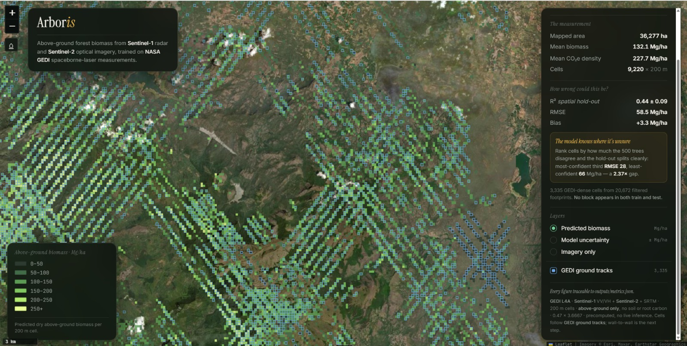

# Arboris — satellite audit layer for forest carbon credits

Arboris checks how much carbon a forest actually holds, from space, and shows where that
estimate can and cannot be trusted.

NASA's **GEDI** laser measures above-ground biomass directly, but only along narrow orbital
tracks. **Sentinel-1** radar and **Sentinel-2** optical imagery cover everything but do not
measure biomass. Arboris learns what a given biomass looks like in radar + optical at the places
GEDI measured, then predicts it everywhere else.

**Study area:** Nilgiris / Anamalai hills, Western Ghats, Tamil Nadu, India.
**Scope:** above-ground biomass only. No below-ground, soil or dead-wood carbon.



<sub>The dashboard (`frontend/index.html`). Predicted above-ground biomass for each 200 m cell
along GEDI tracks, with a model-uncertainty layer. The panel shows the headline numbers and the
hold-out error. Every figure is read from `outputs/metrics.json`.</sub>

---

## Results

Every figure comes from a file in `outputs/` (hashes in `outputs/manifest.json`).
Nothing is synthetic.

### Biomass and carbon

| | |
|---|---|
| Mapped area | **36,277 ha** (9,220 × 200 m cells crossed by GEDI tracks) |
| Mean above-ground biomass | **132.1 Mg/ha** |
| **Total CO₂e** | **8.26 Mt** (8,259,373 Mg) |
| Model | Random Forest, 23 features, 3,335 training cells |
| **R²** | **0.437 ± 0.093** (spatially blocked hold-out, 5 seeds) |
| **RMSE** | **58.45 ± 4.33 Mg/ha** |
| Bias | +3.31 Mg/ha (~2.5 % of the mean) |

R² 0.437 is **below** the 0.6–0.85 typical of published GEDI models, and we say so. The most
likely cause is missing radiometric slope correction on Sentinel-1 in steep terrain. The split is
spatial rather than random: a random split would inflate the score.

**Per-cell uncertainty that works.** Disagreement among the Random Forest's 500 decision trees
flags which cells to trust. The least-confident third of held-out cells has **2.37×** the RMSE of the most-confident
third (27.8 vs 66.0 Mg/ha).

### Tree crowns (demo tile only)

detectree2 pretrained `250312_flexi`, no fine-tune, scored on NEON benchmark tiles with tiles
8–10 held out:

| Precision | Recall | F1 | Truth crowns |
|---|---|---|---|
| 0.59 | 0.39 | **0.47** | 107 |

Per-tree resolution on **one demo tile only**, never across the study area. Fine-tuning on
8 m tiles made results worse because it cut 10–13 m crowns apart. See the validation report §5.

---

## Quickstart

```bash
python -m venv .venv
.venv\Scripts\activate          # macOS/Linux: source .venv/bin/activate
pip install -r requirements.txt
```

**See the demo:** open `frontend/index.html` in a browser. It runs from `file://` with no
server; the data is inlined in `frontend/data.js`.

**Run the API** (serves precomputed files from `outputs/` only):

```bash
uvicorn api.main:app --reload
```

`GET /api/crowns` returns the demo-tile crowns (GeoJSON, EPSG:4326) and the tree count.

**Run the tests:**

```bash
python -m pytest tests/ -q
```

## Reproducing the numbers

```bash
python src/data/train_model.py   # train the Random Forest → metrics.json, plots
python src/diagnostics.py        # hold-out diagnostics, uncertainty calibration
python src/predict_cells.py      # predict all cells, carbon totals, demo data
python src/manifest.py           # sha256 of every artefact
```

`RANDOM_SEED = 42` throughout. The training table `data/arboris_training.csv` was exported from
Google Earth Engine. No Earth Engine access is needed to reproduce the results.

Crown detection needs a CUDA GPU with detectron2 and detectree2, so it ran on Colab
(`notebooks/detectree2.ipynb`). `src/models/crowns.py` holds the ported code, with every setting in
`config/config.yaml`. Its output, `outputs/demo8_crowns.geojson`, is committed.

## Repository layout

```
api/main.py              FastAPI — static artefact serving, /api/crowns
config/config.yaml       every tunable (crown detection settings)
data/                    training table (GEDI + Sentinel-1/2 + terrain), crown demo tile
docs/methodology.md      how it works, data, model, carbon math
docs/validation_report.md  accuracy, saturation, uncertainty, crowns, known weaknesses
frontend/                single-page demo (no build step)
models/arboris_rf.pkl    trained Random Forest
notebooks/detectree2.ipynb  crown detection run (Colab)
outputs/                 every number and map the demo shows
src/carbon/math.py       AGB → carbon → CO₂e, with unit sanity checks
src/data/train_model.py  model training
src/diagnostics.py       validation diagnostics
src/predict_cells.py     cell predictions + carbon totals
src/manifest.py          artefact provenance
src/models/crowns.py     tree-crown detection and scoring
tests/                   carbon arithmetic, crown scoring, API
```

## Known limitations

1. Predictions cover only cells crossed by GEDI tracks, not wall to wall.
2. Optical and C-band radar saturate in dense canopy. Above 300 Mg/ha the model under-predicts.
3. No Sentinel-1 slope correction yet. This is the likely main cost to R².
4. One date only, so there is no change detection yet.
5. Carbon fraction 0.47 is the IPCC default; the model's RMSE dominates the error, not this constant.

Full detail: [docs/methodology.md](docs/methodology.md) ·
[docs/validation_report.md](docs/validation_report.md)
